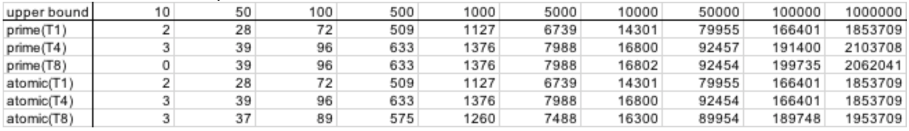
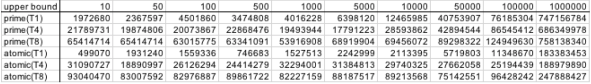
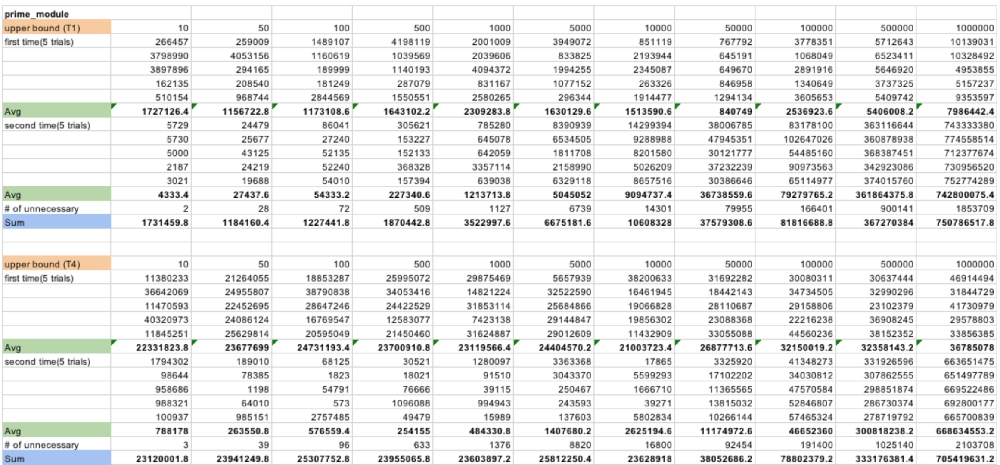
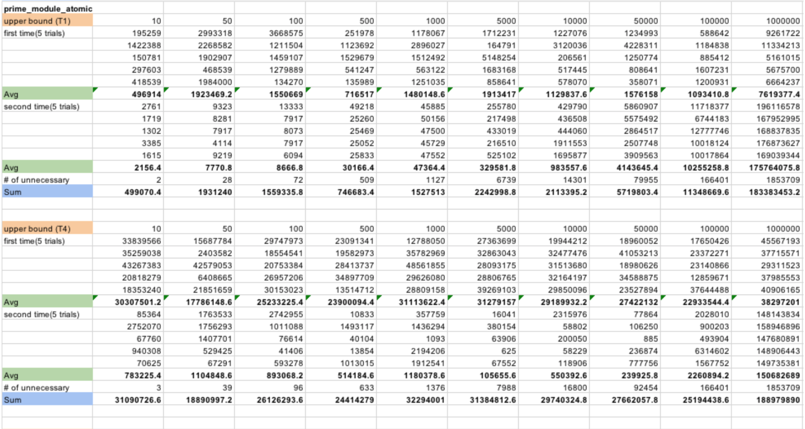
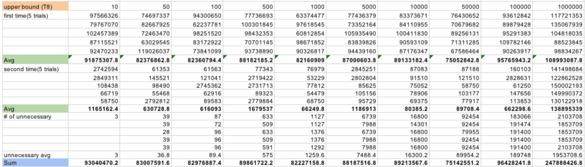
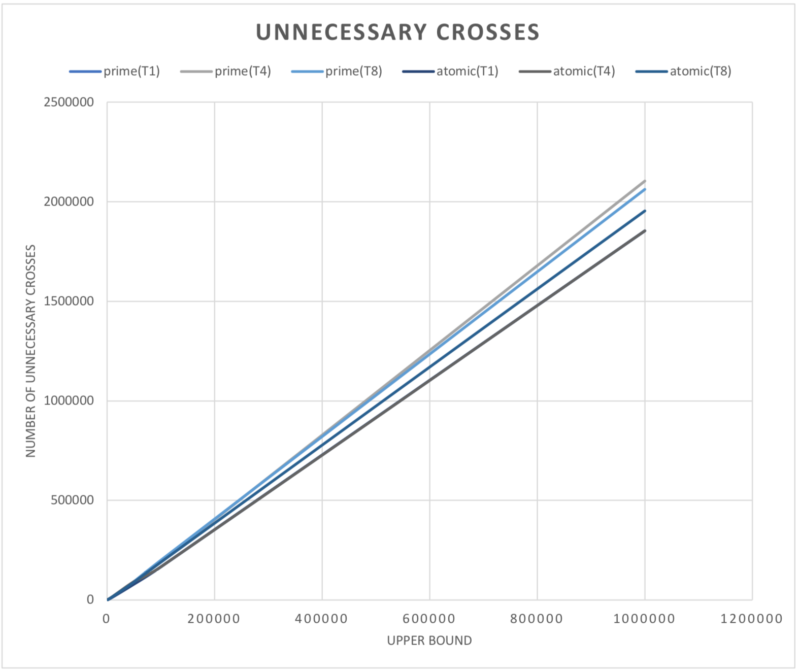
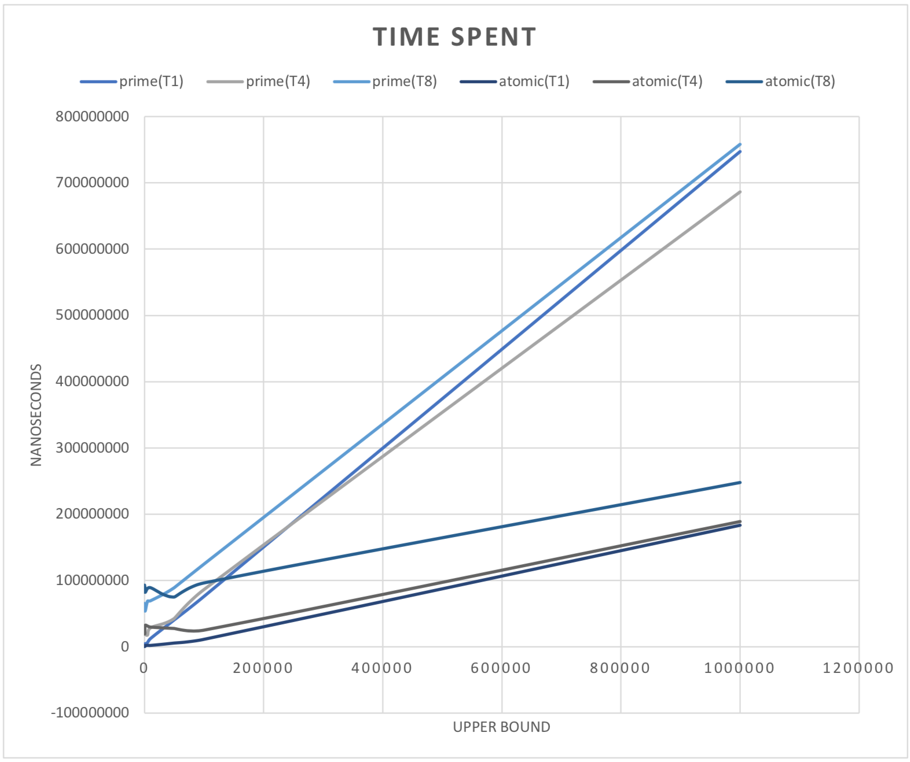

# # Spring 2018 :: CSE 422S Lab 2 - Kernel Module Concurrent Memory Use
 This lab implements a kernel module in which kernel threads will run concurrently on Raspberry Pi to cooperatively compute prime numbers. To do so, we use kernel memory allocation and deallocation, synchronization, and logging.

# # Module Design
#### Our preemption entry holds the following functions:
- *prime_init*(*void*) - This function is called when the kernel module is loaded. This function does the sanity check for user input variables (upper_bound and num_threads) and initializes all our variables, including an array containing integers and array containing counter for each thread. Then it creates and wakes up kernel threads using kthread_create.
- *run*(*void* **counter*) - This is a function that each created thread runs. It calls the first barrier synchronization, processes primes, the second barrier synchronization, sets a variable indicating all work is finished, and exits.
- *first_barrier_sync(void)*, *second_barrier_sync*(*void*) - These functions wait for all threads to arrive at a barrier point. There are two stopping points--before processing the primes and after--so we built separate barrier synchronization function for each instance. Each function uses while(1) loop to wait for all threads to arrive at the loop and exits once all of them arrive.
- *mark_primes*(*int* **counter*) - This function repeatedly marks off non-primes until all integers in our prime array are processed. First, we have a global variable, position, that tracks the next index a thread should run. This variable is locked and unlocked so that only one thread can read and write at a time. Next, we store the integer at the index and mark off multiples of that index until the end of the array. Once there are no more integers to look at, we exit and return.
- *prime_exit*(*void*) - This function gets called when unloading the module. It iterates through the array of primes and lists out the primes. It prints out the logistics of the threads that ran and deallocates any memory used.
- *get_current_time*(*void*) - This is a function that gets current time and converts to nanosecond.

# # Module Performance
After writing the code and building the program, we ran over 100 trials with different variables to observe how our programs perform. We tested with upper bounds from 10 going up to 1,000,000 on 1 thread, 4 threads, and 8 threads on both locking module and atomic module. After running each trial, we took the measurement of the number of unnecessary crosses, initialization time, and processing time. The final results are the following:
##### * The number of unnecessary cross-outs:
  

##### * The runtime of the programs:
  

##### * For each entry, we ran 5 trials and took the average:
  
  
  
##### * We graphed the values to see the trend:
  

##### * We graphed total time over different span of upper bounds:
  

### Obvservation:
1. The number of unnecessary crosses has a linear relation with an upper bound. When upper bound gets big, the atomic module, in general, performs less unnecessary crosses. We predict that this is because atomic variables have more fine-grained locking scheme, so they are more accurate in updating each variable, thus less overlapping per each thread.
2. The length of time each program runs also has a linear relation with the upper bound, but atomic module performs much faster. When upper bound is less than 100,000, the atomic module performs longer than the locking module because it takes longer time initializing. However, when upper bound gets larger than 100,000, the atomic module performs significantly better. We concluded that this is because atomic variables take less overhead updating variables, and no threads have to wait for long for locks.
3. We also observed that more threads don’t necessarily mean better performance. When there are more threads, it takes longer to initialize. When the number of threads exceeds the number of CPUs available, it performs as if there is only one thread. Thus we conclude that atomic module with four threads performs the best here.

### Additional Work:
We implemented the Sieve of Sundaram method to compute primes. However, it fails at certain trials. We suppose that it is a boundary problem, but we couldn’t figure out at which boundary it was failing. If we can figure out the problem and successfully run the program for all different variables, we predict that it would perform much faster and there will be less unnecessary crosses.

# # Contributors

* [Hakkyung Lee][HL] (hakkyung@wustl.edu)
* [Annie Chaehong Lee][AL] (annie.lee@wustl.edu)

[HL]: <https://github.com/hklee93>
[AL]: <https://github.com/anniechaehonglee>